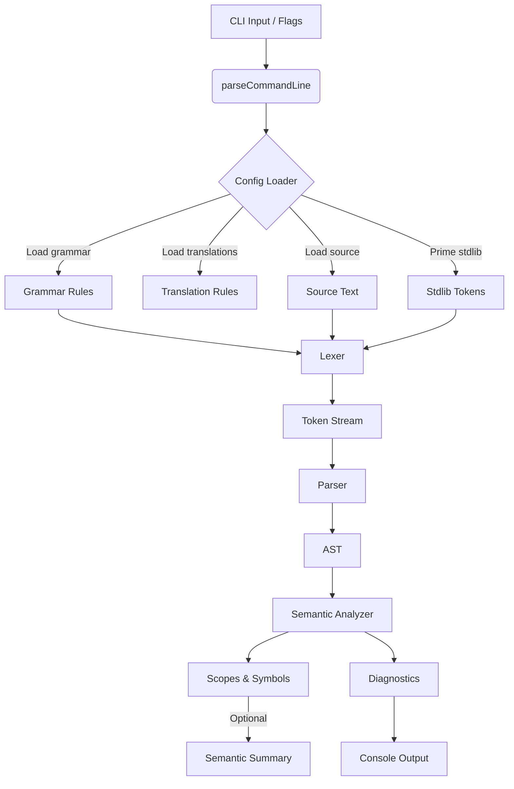
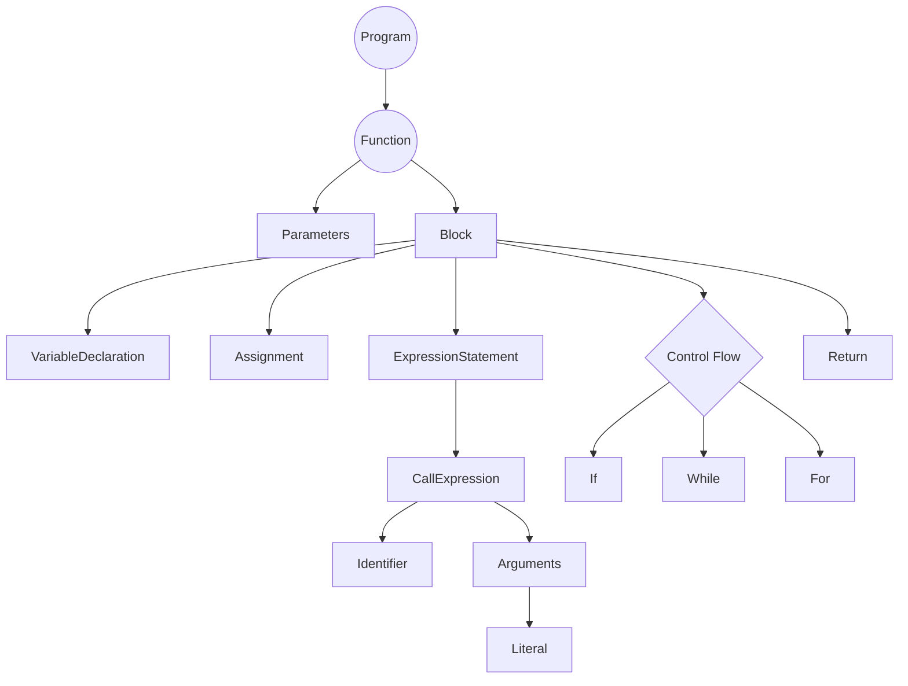

# IStudio Compiler Architecture

This document captures the current end-to-end structure of the Impossible Programming Language (IPL) compiler prototype, the responsibilities of each subsystem, and the key decisions that shape future roadmap investments. It is intended for engineers onboarding to the project as well as contributors planning substantial changes.

## 1. System Overview

The IStudio toolchain is a single executable that orchestrates lexing, parsing, semantic analysis, and (future) lowering/code generation. It consumes configuration files that describe the grammar and translation rules for IPL, ships a stub standard library, and exposes a CLI-focused developer experience.

### 1.1 Context Diagram

```mermaid
flowchart LR
    Developer[[Developer CLI]] -->|commands| IStudioCLI
    IStudioCLI[[`IStudio` Binary]] -->|loads| ConfigFiles[(Grammar & Translation Files)]
    IStudioCLI -->|lexes| Source[IPL Source]
    IStudioCLI -->|primes| Stdlib[Stub Stdlib (*.ipl)]
    IStudioCLI -->|diagnostics| Console[(Diagnostics Output)]
    IStudioCLI -->|artifacts| FutureIR[(IR / Codegen Outputs)]
```

### 1.2 Architectural Pillars

- **Config-driven pipeline** - grammar and translation rules live outside the binary. The compiler reads them on demand via `Config`.
- **Composable phases** - lexing, parsing, and semantic analysis run sequentially and can short-circuit on failure.
- **Transparent diagnostics** - every phase reports through `istudio::DiagnosticEngine`, ensuring consistent formatting and severity.
- **CLI ergonomics** - the `Compiler` agent in `src/main.cpp` wires commands, flags, and batch scripts together.

### 1.3 Key Concepts Glossary

- **Phase** - A discrete processing stage (lexing, parsing, semantic analysis) that consumes the previous stage's output and may stop the pipeline if errors occur.
- **Token** - The smallest meaningful unit produced by the lexer (identifier, keyword, punctuation). Tokens include text, kind, and source location.
- **AST (Abstract Syntax Tree)** - A hierarchical representation of the program built by the parser, with nodes for functions, statements, and expressions.
- **Symbol Table** - A mapping from identifier names to symbol metadata (kind, type, scope) created during semantic analysis.
- **Semantic Analyzer** - The component that walks the AST, enforces rules (no redeclarations, references must resolve), and records scopes.
- **Stdlib Priming** - Pre-tokenizing shipped IPL modules so they are visible to the semantic analyzer before user code runs.

## 2. Component Map

| Area | Location | Responsibilities | Key Types |
| --- | --- | --- | --- |
| CLI / Orchestrator | `src/main.cpp` | Parse options, pick command (`compile`, `run`, `lex-samples`, etc.), invoke pipeline, print summaries | `Compiler`, `CommandLineOptions` |
| Configuration | `include/Config.h`, `src/Config.cpp` | Load grammar, translation rules, and source text; provide structured accessors | `Config`, `GrammarRule`, `TranslationRule` |
| Diagnostics | `include/istudio/Diagnostics.h`, `src/istudio/Diagnostics.cpp` | Collect and expose warnings/errors with optional source ranges | `DiagnosticEngine`, `Diagnostic` |
| Lexing | `include/istudio/Lexer.h`, `src/istudio/Lexer.cpp` | Tokenize source based on configured grammar (current impl is a placeholder line tokenizer) | `Lexer`, `Token`, `LexerOptions` |
| Parsing | `include/Parser.h`, `src/Parser.cpp` | Build an AST of functions, statements, and expressions | `Parser`, `ASTNode`, `FunctionNode`, etc. |
| Semantic Analysis | `include/semantic/*.h`, `src/semantic/*.cpp` | Walk AST, build nested scopes, flag redeclarations/unknown symbols | `SemanticAnalyzer`, `SymbolScope`, `TypeContext` |
| Samples & Stdlib | `examples/`, `stdlib/` | Reference IPL programs and pre-tokenized modules | Sample `.ipl` files |
| Tooling Scripts | `scripts/run_ipl_suite.sh`, `scripts/test_ipl_samples.sh` | Smoke-test CLI flows in CI/dev shells | Shell scripts |

### 2.1 Component Relationships

```mermaid
graph LR
    CLI[CLI (main.cpp)] --> CFG[Config Loader]
    CLI --> LXR[Lexer Wrapper]
    CLI --> PAR[Parser]
    CLI --> SEM[Semantic Analyzer]
    CFG -->|Grammar| LXR
    CFG -->|Translation Rules| PAR
    CFG -->|Source + Stdlib| LXR
    LXR --> TOK[Token Stream]
    TOK --> PAR
    PAR --> AST[AST]
    AST --> SEM
    SEM --> SYM[Symbol Scopes]
    SEM --> DIAG[Diagnostics]
    DIAG --> OUT[Console Output]
```

## 3. Execution Flow

### 3.1 High-Level Sequence

```mermaid
sequenceDiagram
    participant CLI as CLI Entry (`main`)
    participant CFG as Config Loader
    participant LEX as Lexer
    participant PAR as Parser
    participant SEM as Semantic Analyzer
    participant OUT as Console Output

    CLI->>CFG: Resolve grammar/translation paths
    CLI->>CFG: Load stdlib & source text
    CFG-->>CLI: `LexerOptions`, translation rules, source
    CLI->>LEX: Tokenize stdlib files (priming)
    LEX-->>CLI: Token stream (skipping comments/EOF)
    CLI->>LEX: Tokenize user program
    LEX-->>CLI: User token stream | diagnostics
    CLI->>PAR: Build AST
    PAR-->>CLI: AST | parse diagnostics
    CLI->>SEM: Analyze scopes (optional `--emit-sema`)
    SEM-->>CLI: Symbol tree, semantic diagnostics
    CLI->>OUT: Print diagnostics / symbol summaries
```

### 3.2 Detailed Compiler Agent Lifecycle

1. **Option Parsing** - `parseCommandLine` in `src/main.cpp` interprets flags, sets defaults, and validates required parameters.
2. **Resource Resolution** - `Compiler::compileWithConfig` loads grammar, translation rules, stdlib, and source code through `Config`, capturing failures early.
3. **Stdlib Priming** - `loadStandardLibraryTokens` tokenizes each `stdlib/*.ipl` file so downstream phases have visibility of core symbols.
4. **Lexing** - `lexSourceToTokens` wraps `istudio::Lexer`. The current placeholder lexer tokenizes per line; known issues are tracked in section 8.
5. **Parsing** - `Parser` constructs a rich AST, covering functions, blocks, control flow, expressions, and calls.
6. **Semantic Analysis** - `semantic::SemanticAnalyzer` builds nested scopes, registers declarations, and flags redeclarations or undefined identifiers. With `--emit-sema`, it prints a human-readable scope summary.
7. **Diagnostics & Exit** - All collected diagnostics are printed uniformly. Non-zero exit codes bubble up for failed phases.

> Pipeline rule of thumb: every step receives concrete data structures, transforms them, and either hands off to the next step or emits diagnostics and stops.

### 3.4 Phase Inputs and Outputs

| Phase | Input | Output | Notes |
| --- | --- | --- | --- |
| Configuration loading | CLI flags, environment, optional project manifest | `Config` object with source text, grammar, translation rules | Errors here usually mean a path is wrong or the file is missing. |
| Stdlib priming | File list from `stdlib/` | Token vector for each stdlib file | Tokens are cached in-memory during the run; no files are modified. |
| Lexing | User source text, lexer options built from grammar rules | Token vector (minus comments/EOF) | Placeholder lexer will soon be replaced by a grammar-driven implementation. |
| Parsing | Token vector | `ProgramNode` AST | If syntax errors occur, diagnostics are emitted and semantic analysis is skipped. |
| Semantic analysis | AST, initial symbol table, type context | Updated symbol scopes, optional semantic summary | Fails fast on redeclarations or unresolved identifiers. |
| Diagnostics reporting | Aggregated diagnostics from all phases | Console output, exit code | Non-zero exit code signals at least one error/fatal diagnostic. |

### 3.3 Data Flow Diagram



## 4. Data Contracts

- **Tokens** (`include/istudio/Token.h`): Lightweight structs containing kind, lexeme, and source location metadata.
- **Abstract Syntax Tree** (`include/AST.h`): Hierarchical nodes (program, functions, statements, expressions) expressed via smart pointers.
- **Symbol Table** (`include/semantic/SymbolTable.h`): Persistent scopes (`SymbolScope`) linked in a parent/child chain; symbols capture name, kind, and type metadata.
- **Translation Rules** (`include/Config.h`): Pre-parsed entries mapping source constructs to target backends - currently staged for future IR/codegen work.

Each structure deliberately avoids owning global state so phases can be composed, tested, and reset independently during future incremental compilation work.

### 4.1 AST Shape Overview



## 5. Diagnostics & Observability

- **Engine** - `DiagnosticEngine` aggregates diagnostics across phases and exposes them as `std::vector<Diagnostic>` for printing or structured inspection.
- **Printing** - `printDiagnostics` in `src/main.cpp` provides consistent severity formatting and optional source ranges.
- **Testing Hooks** - CLI commands `--help`, `--version`, `--lex-ipl-samples`, and the `--emit-sema` flag are all wrapped in CTest invocations (see `CMakeLists.txt:193`).
- **Future Enhancements** - Source ranges are already tracked; hooking them into column-accurate lexing will unlock IDE integrations.

## 6. Extensibility Path

- **IR & Codegen** - Defined in depth within `docs/roadmap_semantic_ir_codegen.md`. Translation rules and AST typing hooks are already in place, awaiting concrete IR data structures.
- **Grammar Standards** - `--standard` flag lets the CLI resolve named grammar presets (currently only `ipl`, but the lookup is designed for more).
- **Plugin Opportunities** - The `Compiler` agent can grow subcommands (e.g., `format`, `lint`) with minimal changes thanks to centralized option parsing.

## 7. Compiler Agent Responsibilities

The `Compiler` class in `src/main.cpp` acts as the primary orchestration agent. Its responsibilities include:

- Translating CLI intent into pipeline execution (direct compile, project manifest, stdin, sample lexing).
- Resolving resource paths and default fallbacks when explicit files are not provided.
- Priming the semantic environment by tokenizing stdlib modules before user code.
- Coordinating diagnostics presentation, semantic summaries, and verbose logging.
- Providing integration hooks (`RUN_COMPILER_TEST`, `--emit-sema`) for CI and developer tooling.

## 8. Known Limitations & Technical Debt

- **Lexer placeholder** - Current lexer tokenizes by line and tags everything as `Unknown`. Replacing it with a grammar-driven implementation is the top priority for semantic fidelity.
- **Error recovery** - Parser's `synchronize` method is basic; nested error contexts can cascade, impacting developer feedback.
- **Type system gaps** - `TypeContext` only surfaces built-ins. Complex type inference, generics, and ownership qualifiers remain TODO items.
- **Translation rule usage** - Rules are parsed but not yet exercised because IR/codegen is still in flight.
- **Testing coverage** - Sample scripts exist, but in-tree unit tests for parser/semantic paths are minimal.

### Common Failure Modes

- **Missing grammar file** - Pipeline stops early while resolving configuration; ensure paths are correct or rely on defaults.
- **Lexer failure** - Currently rare because of placeholder implementation, but future grammar-driven lexer will return diagnostics that halt parsing.
- **Parser error** - `hadError()` becomes true, returning a partial AST and emitting diagnostics. Semantic analysis is skipped.
- **Semantic failure** - Redeclarations or unresolved identifiers mark the compile as unsuccessful; diagnostics explain which scope triggered the error.

## 9. Testing & Automation

- **CTest** - `CMakeLists.txt` registers CLI smoke tests and invalid-program regressions.
- **Shell suites** - `scripts/run_ipl_suite.sh` and `scripts/test_ipl_samples.sh` encapsulate end-to-end checks for valid and invalid samples.
- **Environment variables** - `RUN_COMPILER_TEST=1` triggers an in-memory compile path useful for integration verification.

## 10. Reference Materials

- `docs/usage.md` - CLI reference, project manifest contract, and automation pointers.
- `docs/roadmap_semantic_ir_codegen.md` - Detailed milestone planning for Semantic -> IR -> Codegen.
- `docs/project_status.md` - Release notes, known issues, and TODO backlog.
- `docs/feature_matrix.md` - Point-in-time snapshot of implemented features and placeholders.
