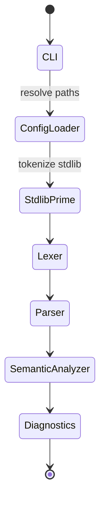
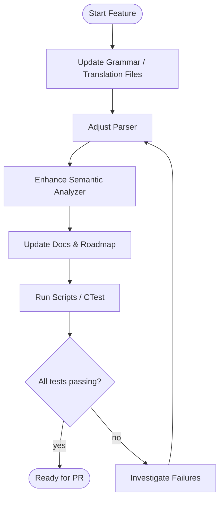

# Developer Guide

This guide consolidates the operational knowledge needed to build, debug, and extend the IStudio compiler. Pair it with `docs/compiler_architecture.md` for deeper architectural details and `docs/project_status.md` for current priorities.

## 1. Getting Started

### 1.1 Prerequisites

- **Operating system**: Linux, macOS, or Windows with a POSIX-compatible shell.
- **Tooling**: CMake 3.28.3+, a C++23 compiler (GCC 14+, Clang 16+, or MSVC v19.38+), Git.
- **Optional**: Python 3.11+ for scripting, Ninja for faster builds, `clang-format` for style consistency.

### 1.2 Initial Setup

1. Clone and enter the repository:
   ```bash
   git clone <repo-url>
   cd IStudio
   ```
2. Configure a build directory:
   ```bash
   cmake -S . -B build -DCMAKE_BUILD_TYPE=RelWithDebInfo
   ```
3. Build the compiler:
   ```bash
   cmake --build build -j
   ```
4. Run smoke tests (optional but recommended):
   ```bash
   cmake -S . -B build -DBUILD_TESTING=ON
   cmake --build build
   (cd build && ctest)
   ```
5. Verify the binary:
   ```bash
   ./build/IStudio --version
   ```

### 1.3 Repository Layout

| Path | Purpose |
| --- | --- |
| `src/` | Primary source tree for the CLI (`main.cpp`), parser, lexer, semantic analysis, and utilities. |
| `include/` | Public headers grouped by subsystem (`istudio/`, `semantic/`, core AST/Parser headers). |
| `examples/` | Sample IPL programs, grammar files, translation rules, and project manifests. |
| `stdlib/` | Stub IPL modules that simulate a standard library for semantic analysis. |
| `docs/` | Documentation set (usage guides, roadmap, developer guide, architecture notes, status log). |
| `scripts/` | Shell helpers for running sample suites and regression checks. |
| `tests/` | Placeholder for future unit/integration tests (currently minimal). |

> New to CMake? Treat `build/` as disposable output. Reconfigure when switching compilers or flags.

### 1.4 Using CMake Presets

- Configure with the bundled preset:
  ```bash
  cmake --preset "Configure preset using toolchain file"
  ```
- Build the configured tree:
  ```bash
  cmake --build out/build/Configure\ preset\ using\ toolchain\ file
  ```
- Install artifacts (optional):
  ```bash
  cmake --install out/build/Configure\ preset\ using\ toolchain\ file
  ```

The preset pins the Ninja generator, places outputs under `out/`, and leaves `CMAKE_TOOLCHAIN_FILE` empty so you can drop in a custom toolchain when needed.

## 2. Command-Line Operations

| Task | Command | Notes |
| --- | --- | --- |
| Compile a file | `IStudio compile src/main.ipl` | Use `--grammar`/`--translation` to override defaults |
| Compile via manifest | `IStudio run --project examples/projects/hello.ini` | Paths inside the manifest resolve relative to the manifest file |
| Tokenize samples | `IStudio --lex-ipl-samples` | Convenience alias for `lex-samples` |
| Semantic summary | `IStudio compile demo.ipl --emit-sema` | Prints scope tree after analysis |
| Stdin workflow | `echo 'function main() {}' \| IStudio --stdin` | Temporary file is created and removed automatically |

See `docs/usage.md` for detailed flag descriptions and additional troubleshooting tips.

## 3. Pipeline Flow



The `Compiler` agent (see section 5) coordinates each transition, short-circuiting the flow if diagnostics report fatal errors.

## 4. Core Data Structures

| Structure | Purpose | Defined In |
| --- | --- | --- |
| `GrammarRule` / `TranslationRule` | External configuration that shapes lexing and future lowering | `include/Config.h` |
| `Token` + `LexerOptions` | In-memory representation of lexed source, including source locations | `include/istudio/Token.h` |
| `ASTNode` hierarchy | Parsed representation of programs, functions, statements, and expressions | `include/AST.h` |
| `Symbol`, `SymbolScope` | Semantic metadata for declarations within nested scopes | `include/semantic/SymbolTable.h` |
| `PhaseResult<T>` | Utility alias for returning result-or-diagnostics from each phase | `include/istudio/Token.h` |

## 5. Agents & Responsibilities

| Agent | Role | Key Methods |
| --- | --- | --- |
| `Compiler` (`src/main.cpp`) | Primary orchestrator handling CLI, resource loading, diagnostics, and optional semantic summaries | `compileWithConfig`, `compile`, `indexAST` |
| `Config` (`src/Config.cpp`) | Resolves grammar, translation, and source files, trimming comments and whitespace | `loadGrammarFile`, `loadTranslationRules`, `loadSourceCode` |
| `istudio::Lexer` (`src/istudio/Lexer.cpp`) | Tokenizes stdlib and user source (currently line-based placeholder) | `tokenize` |
| `Parser` (`src/Parser.cpp`) | Builds strongly-typed AST, handles control flow and expressions, attempts basic recovery | `parse`, `parseStatement`, `parseFunction` |
| `semantic::SemanticAnalyzer` (`src/semantic/`) | Creates nested scopes, checks redeclarations, emits symbol summaries | `analyze`, various `visit*` methods |

## 6. Development Workflows

### 6.1 Implementing Language Features

1. Update grammar/translation files in `examples/` or custom config directories.
2. Enhance the parser to recognize new constructs, adding AST nodes if necessary.
3. Extend the semantic analyzer to register new symbols or enforce rules.
4. Document the behavior in `docs/usage.md` and add roadmap/status updates as appropriate.
5. Run sample suites and targeted CTest cases to validate the change.



### 6.2 Debugging Diagnostics

- Launch the CLI with `--verbose` to surface stdlib loading and token counts.
- Capture output to a file and inspect `[error]` or `[warning]` tags emitted by `printDiagnostics`.
- Use `--emit-sema` to view scope trees when investigating naming or redeclaration issues.
- Add temporary logging within the parser or semantic analyzer; remove before committing.
- Use the `RUN_COMPILER_TEST=1` environment variable to exercise a fixed in-memory program without needing external files:
  ```bash
  RUN_COMPILER_TEST=1 ./build/IStudio
  ```
- When diagnosing lexer issues, run `IStudio --lex-ipl-samples` to compare token counts before and after changes.

### 6.3 Working with Projects

- Maintain `ipl_project.ini` manifests per project root; relative paths keep repositories portable.
- When switching grammar standards, prefer `--standard <name>` to keep command lines short.
- Scripts under `scripts/` automate smoke testing across curated valid/invalid sample sets.
- Keep manifests under version control so grammar or translation changes travel alongside source edits.

### 6.4 Contribution Checklist

1. Update or add tests (CLI, scripts, future unit tests) to capture regressions.
2. Rebuild the project to ensure no compilation warnings or errors.
3. Run `ctest` if `BUILD_TESTING` is enabled, or execute the relevant scripts under `scripts/`.
4. Update documentation (`docs/usage.md`, `docs/project_status.md`, and this guide) when behavior or workflows change.
5. Create a focused commit with explanatory messages before opening a Pull Request.

```mermaid
gantt
    title Contribution Checklist Timeline
    dateFormat  X
    axisFormat  "%L"
    section Pre-submit
    Update Tests          :done, 0, 1
    Build Project         :active, 1, 1
    Run Test Suite        : 2, 1
    Refresh Documentation : 3, 1
    Prepare Commit/PR     : 4, 1
```



## 7. Testing Strategy Summary

| Layer | Tooling | Notes |
| --- | --- | --- |
| Unit (planned) | Future `tests/` tree using CTest/GoogleTest | Targeted checks for parser productions and semantic errors |
| CLI smoke | CTest entries defined in `CMakeLists.txt` | Help/version, lexing, valid/invalid compile paths |
| Integration | `scripts/run_ipl_suite.sh`, `scripts/test_ipl_samples.sh` | Build + execute curated IPL samples |
| Manual | `--emit-sema`, `--verbose` runs | Useful while the lexer remains a placeholder |

## 8. Issue Tracking & Backlog

- **Solved bugs** and **known issues** are cataloged in `docs/project_status.md` (sections 3-4).
- **TODO backlog** with priorities lives in the same document (section 5).
- Align feature work with the multi-phase roadmap in `docs/roadmap_semantic_ir_codegen.md`.

## 9. Frequently Asked Questions

- **Why do tokens have both `text` and `lexeme`?** `text` references the original buffer via `std::string_view`; `lexeme` stores an owning copy used by the placeholder lexer.
- **Why is lexing so limited?** The placeholder tokenizer unblocks pipeline exploration; replacing it with a grammar-aware implementation is Priority 0.
- **How will IR/codegen integrate?** Translation rules already parsed by `Config` will feed lowering passes described in the roadmap.

## 10. Additional Resources

- `docs/compiler_architecture.md` - Architecture, flows, and data diagrams.
- `docs/roadmap_semantic_ir_codegen.md` - Detailed milestones for semantic, IR, and codegen work.
- `docs/project_status.md` - Status log, known issues, TODO backlog, and risk notes.
- `docs/usage.md` - CLI reference, workflows, and troubleshooting.

Keep this guide updated when new tooling, workflows, or agents are introduced so contributors have a single source of truth for day-to-day development.
