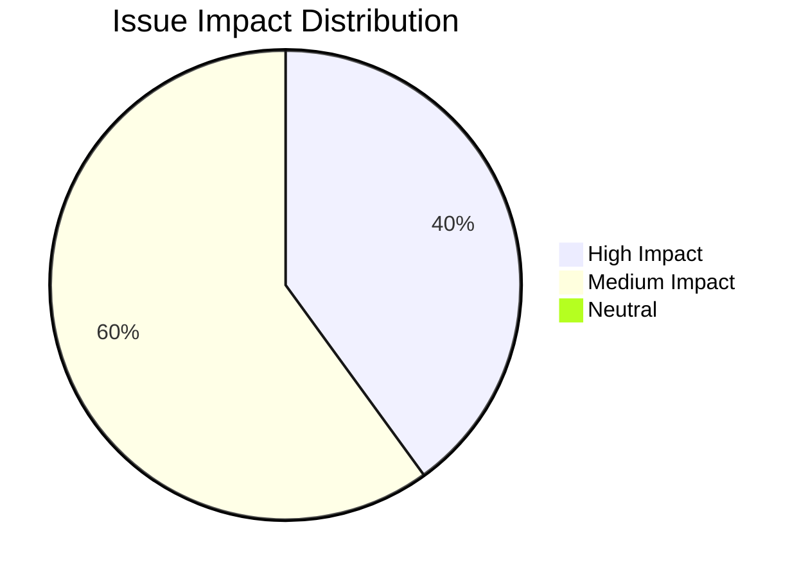

# Project Status & Engineering Log

This document captures the operational status of the IStudio compiler prototype: recent functional changes, resolved defects, outstanding issues, and the prioritized TODO backlog. It is updated as part of every significant development sprint.

Use it to answer three questions quickly:
- *What changed recently?* See section 2 for the latest merged work.
- *What should I fix next?* Review sections 4 and 5 for open issues and TODOs.
- *What decisions are pending?* Section 6 records open questions that need ownership.

## 1. Release Snapshot

- **Version:** Prototype 0.2.x (see `--version`).
- **Compiler agent:** `Compiler` class in `src/main.cpp` orchestrates pipeline phases, stdlib priming, and CLI reporting.
- **Supported flows:** `compile`, `run`, `lex-samples`, stdin compilation, demo mode, and semantic summaries via `--emit-sema`.
- **Test coverage:** CLI smoke tests registered in `CMakeLists.txt` plus shell suites under `scripts/`.

## 2. Recent Changes

| Area | Description | References |
| --- | --- | --- |
| Semantic summaries | Added `--emit-sema` flag to print scope trees after analysis, improving debugging of name resolution. | `src/main.cpp`, `docs/usage.md` |
| Documentation | Architecture and usage docs overhauled with diagrams, status tracking, and cross-references for faster onboarding. | `docs/compiler_architecture.md`, `docs/README.md` |
| Stdlib priming | All compiles pre-tokenize `stdlib/*.ipl`, preventing missing symbol diagnostics when user code references core modules. | `src/main.cpp` (`loadStandardLibraryTokens`) |
| Build tooling | Added Ninja-based CMake preset for consistent configure/build/install flows. | `CMakePresets.json`, `docs/usage.md`, `docs/developer_guide.md` |

## 3. Solved Bugs / Stabilized Behaviors

| Issue | Resolution | Evidence |
| --- | --- | --- |
| Function or variable redeclarations were silently accepted. | Semantic analyzer now rejects duplicates by checking each scope before insertion. | `src/semantic/SemanticAnalyzer.cpp` (`visitFunction`, `visitVariableDeclaration`) |
| Project manifests lacking grammar/translation entries caused failures. | `loadProjectConfig` now falls back to default IPL grammar and translation files. | `src/main.cpp` (`loadProjectConfig`) |
| Diagnostics were inconsistent across phases. | Centralized printing via `printDiagnostics` ensures uniform severity labels and location formatting. | `src/main.cpp` (`printDiagnostics`) |

## 4. Known Issues

| Category | Description | Impact | Tracking |
| --- | --- | --- | --- |
| Lexing | Placeholder lexer treats each line as `Unknown`, skipping grammar-based token classification. | Prevents full syntax coverage; downstream parsing relies on heuristics. | High | `src/istudio/Lexer.cpp` |
| Parsing | Error recovery is minimal; cascading failures can mask root causes. | Medium developer ergonomics impact. | Medium | `Parser::synchronize` |
| Semantic typing | Type hierarchy only covers built-ins; no inference or ownership checks yet. | Blocks advanced validation and IR readiness. | High | `include/semantic/Type.h` |
| Translation rules | Parsed but unused until IR/codegen exists. | Neutral now; required for future backends. | Medium | `Config::loadTranslationRules` |
| Testing | Lack of granular unit tests for parser/semantic components. | Reduces confidence during refactors. | Medium | Test plan |
| IR lowering | `ir/Lowering.cpp` creates modules/blocks but emits no instructions. | Blocks downstream IR tooling. | High | `ir/Lowering.cpp` |

## 5. TODO Backlog

| Priority | Work Item | Notes |
| --- | --- | --- |
| P0 | Implement grammar-driven lexer (regex/token automata) and attach precise source ranges. | Unlocks accurate parsing + diagnostics. |
| P0 | Expand semantic analyzer with type checking, ownership semantics, and control-flow validation. | Required for Milestone A in roadmap. |
| P1 | Introduce IR data structures and `--emit-ir` flag (see roadmap). | Enables optimization and code generation phases. |
| P1 | Add unit tests for parser productions and semantic error cases. | Complement shell suites; target `tests/` tree. |
| P1 | Implement statement-to-IR lowering (control flow, expressions, returns). | Completes placeholder logic in `ir/Lowering.cpp`. |
| P2 | Surface diagnostics in structured formats (JSON) for IDE integration. | Builds on existing `DiagnosticEngine`. |
| P2 | Provide example manifests that cover custom grammar standards. | Improves documentation for multi-language scenarios. |

## 6. Open Questions & Follow-Ups

| Topic | Owner | Next Step |
| --- | --- | --- |
| Lexer implementation detail | TBD | Decide between hand-written DFA vs. regex engine + codegen tooling |
| Type system expressiveness | TBD | Document desired ownership semantics and generics syntax in design RFC |
| IR serialization format | TBD | Evaluate whether human-readable IR should double as golden test artifact |
| Codegen target selection | TBD | Pick initial backend (C++ vs. LLVM IR) and capture acceptance criteria |

## 7. Risk & Mitigation Notes

- **Lexer debt:** Until P0 lexer work lands, semantic and parsing accuracy is limited. Mitigation: keep roadmap aligned and avoid over-promising language coverage.
- **Single binary delivery:** All functionality lives in `IStudio`. Mitigation: maintain strict CLI compatibility and document changes in `docs/usage.md` before release.
- **Documentation drift:** Architecture and status docs are now first-class; update `docs/README.md` index whenever new files are added.

## 8. Update Process

1. Amend relevant sections (`Recent Changes`, `Solved Bugs`, `Known Issues`, `TODO`) alongside code changes.
2. Cross-link additional resources to keep onboarding fast (`docs/usage.md`, `docs/roadmap_semantic_ir_codegen.md`).
3. Run documentation checks (spelling/links) before release tagging.
