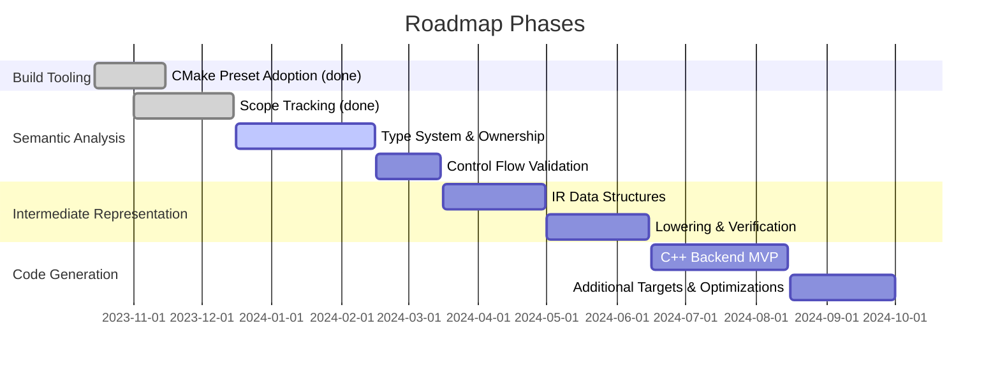

# IPL Compiler Roadmap - Semantic Analysis, IR, and Code Generation

The current toolchain provides a lexer, parser, diagnostics, and skeleton standard library. The next stages
focus on semantic validation, intermediate representation (IR), and eventual code generation. This plan
tracks status, upcoming milestones, dependencies, and risks.

## How to Read This Roadmap

- **Status values** use plain language:
  - *Done* - work is implemented and merged.
  - *In progress* - active development with partial functionality.
  - *Planned* - aligned on scope but not yet started.
  - *Not started* - acknowledged future work.
- **Dependencies** indicate prerequisites that must be ready before a phase can start.
- **Risks** summarize what might delay the phase and list mitigation ideas.
- **Milestones** map directly to the engineering backlog in `docs/project_status.md`.

## Phase 0: Current Capabilities (Baseline)

| Area | Status | Notes |
| --- | --- | --- |
| CLI and pipeline orchestration | Done | `Compiler` agent coordinates lexing -> parsing -> semantic analysis |
| Build tooling (CMake presets) | Done | `CMakePresets.json` seeds Ninja builds with install prefixes |
| Lexing | Placeholder | Line-based tokenizer; full grammar-driven implementation pending |
| Parsing | Done | Function/block/expression coverage with basic recovery |
| Semantic analysis | In progress | Scope tracking, redeclaration detection, `--emit-sema` summaries |
| IR / Codegen | Not started | Documented here for roadmap alignment |

## Phase 1: Semantic Analysis

### Objectives
- Validate symbol usage, types, ownership qualifiers, and control-flow constraints.
- Produce a typed AST or a semantic model that can feed later pipeline stages.
- **Current status:** Scope tracking and redeclaration diagnostics land in `src/semantic/` and power the `--emit-sema` CLI flag today.

### Key Components
1. **Symbol Table & Scopes**
   - Introduce `ScopedSymbolTable` with nested environments for modules, functions, blocks.
   - Track declarations (variables, functions, classes, traits) with type information and mutability flags.
2. **Type System**
   - Define `Type` hierarchy representing primitive types, generics, optionals, ownership qualifiers (`owned<T>`, `borrowed<T>`).
   - Implement `TypeResolver` to map type spellings to canonical `Type` instances, including generics and template parameters.
3. **Semantic Analyzer**
   - Visitor or walker that traverses the AST:
     - Resolve identifiers to declarations, annotate AST nodes with types.
     - Perform type compatibility checks for assignments, function calls, binary/unary operations.
     - Enforce control-flow rules (all paths return in non-void functions, break/continue usage, etc.).
     - Validate ownership moves/borrows if IPL keeps the Rust-inspired model described in the spec.
   - Emit diagnostics via `DiagnosticEngine`, leveraging precise source ranges from tokens.
4. **Constant Folding / Early Evaluation (Optional)**
   - Simple foldable expressions can be evaluated during analysis to feed into later optimization.

### Deliverables
- `include/semantic/Type.h`, `TypeResolver`, `SymbolTable`, `SemanticAnalyzer` classes.
- Annotated AST (e.g., attach `Type*` to each `ASTNode`).
- CLI option `--emit-sema` to print symbol/type summaries.
- Tests: semantic-positive programs in `tests/semantic/valid`, negative cases in `tests/semantic/invalid`.

### Status Snapshot

- Done: Scope management and redeclaration diagnostics landed (`src/semantic/`).
- Planned: Type inference and ownership validation.
- Planned: Control-flow checks.
- Dependency: Grammar-driven lexer remains placeholder and will affect semantic fidelity until replaced.

## Phase 2: Intermediate Representation (IR)

### Objectives
- Lower typed AST into a uniform IR that enables optimization and target-specific code generation.

### IR Design Considerations
- **Module / Function / Basic Block** structure similar to SSA-based IRs.
- **Instruction Set:** loads, stores, arithmetic, control-flow (branch, loop), calls, returns.
- **Type Representation:** reuse `Type` info from semantic phase.

### Implementation Steps
1. IR Data Structures (`include/ir/`)
   - `IRModule`, `IRFunction`, `IRBlock`, `IRInstruction` (with opcode enums and operand lists).
2. Lowering Pass
   - AST -> IR conversion with temporary registers and explicit control-flow blocks.
   - Maintain source location mapping for diagnostics and debugging.
3. Verification & Analysis
   - IR verifier to check block termination, operand counts, SSA properties (if adopted).
   - Optional passes: constant folding, dead code elimination, copy propagation.

### Deliverables
- IR printer (`--emit-ir` CLI flag) to dump human-readable IR.
- Golden-file tests comparing IR output for sample programs.

### Status Snapshot

- Placeholder: `ir/Lowering.cpp` builds module/function shells without translating statements.
- Not started: Instruction selection, SSA form, and IR printer implementation.

### Dependencies

- Requires semantic phase to annotate AST nodes with resolved types and symbols.
- Translation rules must be expanded to map semantic constructs to IR primitives.

## Phase 3: Code Generation

### Objectives
- Emit runnable code for a chosen target (e.g., C++ initially) from the IR.

### Target Strategy
- **C++ Backend**
  - Map each IR function to a C++ function.
  - Manage includes, forward declarations, string literal escaping.
  - Integrate standard library calls (e.g., map `print` to `std::cout`).
- **Future Targets:** Java, Python, or LLVM IR once C++ path stabilizes.

### Implementation Steps
1. Codegen Infrastructure (`include/codegen/`)
   - `CodeGenerator` interface, `CppCodeGenerator` implementation.
2. Emission
   - Translate IR instructions to C++ statements.
   - Write generated code to files; optionally invoke system compiler unless sandboxed.
3. CLI Support
   - `IStudio compile --emit-cpp --output <dir>` to generate translated sources.
   - Optional `IStudio run` to compile & execute if environment allows.

### Deliverables
- C++ emitter producing compilable `.cpp`/`.h` files for sample programs.
- Integration tests building generated C++ for a subset of programs (best-effort in sandboxed environments).

### Dependencies

- IR module must provide stable instruction set and verification.
- Standard library surface area must be formalized for target mappings.

## Cross-Cutting Engineering Tasks
- **Diagnostics:** enrich with type/ownership error messages, add notes/hints.
- **Source Mapping:** preserve original locations through phases for debugging and codegen.
- **Configuration:** permits multiple grammar standards, stdlib modules, backend options.
- **Automation:** extend `scripts/run_ipl_suite.sh` to cover semantic/IR/codegen tests.

## Risk Register

| Risk | Phase | Probability | Impact | Mitigation |
| --- | --- | --- | --- | --- |
| Placeholder lexer blocks accurate parsing | Phase 1 | High | High | Prioritize grammar-driven lexer before complex semantic work |
| Lack of typed AST annotations delays IR | Phase 2 | Medium | High | Ensure type metadata is attached during Phase 1 |
| Codegen target drift without standards | Phase 3 | Medium | Medium | Formalize stdlib ABI and translation rule schema early |
| Test coverage gaps hide regressions | All | Medium | Medium | Add unit + golden tests as phases land |

## Timeline Overview

## Suggested Milestones
1. **Milestone A (Semantic MVP)**
   - Symbol resolution, type checking for primitives and functions.
   - Diagnostics for undefined identifiers, type mismatches, missing returns.
2. **Milestone B (Full Semantic Support)**
   - Ownership qualifiers, control-flow checks, generics placeholders.
   - CLI `--emit-sema` output and tests.
3. **Milestone C (IR MVP)**
   - IR data structures, lowering for expressions, basic control flow.
   - IR printer and tests.
4. **Milestone D (Codegen MVP)**
   - C++ emitter for core features, ability to run translated samples.
   - CLI `--emit-cpp`, documentation/tutorial.
5. **Milestone E (Enhancements)**
   - Optimizations, additional targets, packaging/distribution tools.

This roadmap aligns with the existing architecture and keeps each phase manageable while paving the way toward a full compiler pipeline.
