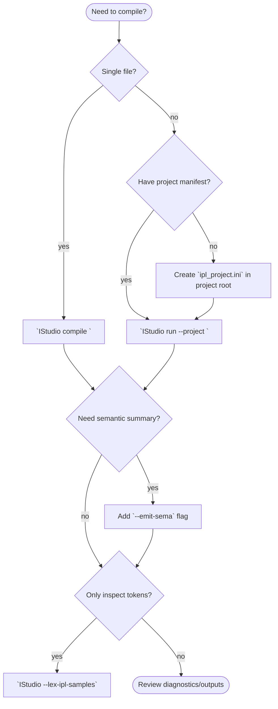

# IStudio CLI Usage

## Quick Start

```
IStudio compile path/to/source.ipl
```

By default the compiler loads the bundled grammar (`examples/ipl/grammar_rules.txt`),
translation rules (`examples/translation_rules.txt`), and the stub standard library in
`stdlib/` before parsing your program. The resulting Abstract Syntax Tree (AST) and
collected symbols are printed when compilation succeeds. Add `--emit-sema` to collect
a semantic symbol summary after parsing.

## Before You Begin

1. Install the prerequisites listed in the root `README.md` (CMake 3.28.3+, C++23 compiler, Git).
2. Generate a build directory and compile the tool:
   ```bash
   cmake -S . -B build -DCMAKE_BUILD_TYPE=RelWithDebInfo
   cmake --build build
   ```
3. Add `build/` to your shell path or invoke the binary via `./build/IStudio`.
4. Optional: enable tests while configuring (`-DBUILD_TESTING=ON`) so `ctest` targets are available.

> Tip: All documentation assumes commands are executed from the repository root unless stated otherwise.

### Configuring with CMake Presets

Prefer the bundled preset when you want a reproducible Ninja build tree:

```bash
cmake --preset "Configure preset using toolchain file"
cmake --build out/build/Configure\ preset\ using\ toolchain\ file
```

To install the compiled binaries, add:

```bash
cmake --install out/build/Configure\ preset\ using\ toolchain\ file
```

You can still create ad-hoc build directories if you need custom cache variables or generators.

## Commands

| Command | Description |
| --- | --- |
| `compile <source>` | Compile a single IPL source file. Use `--grammar`/`--translation` to override rule files. |
| `compile --stdin` | Read source code from standard input, then compile using the selected grammar/translation files. |
| `run [--project file]` | Compile a project described by an `ipl_project.ini` manifest. Paths inside the manifest are resolved relative to the file. |
| `lex-samples` | Tokenize every `examples/ipl/*.ipl` file with the bundled grammar and report token counts. |
| `--demo` | Compile the bundled C-style demo assets (legacy compatibility). |



### Terminology

- **Grammar rules** - Patterns that teach the lexer how to recognize tokens. Stored as plain text with `pattern -> action` lines.
- **Translation rules** - Mappings that describe how IPL constructs should translate in later pipeline stages. Parsed today for future IR/codegen phases.
- **Stdlib** - The stub standard library (`stdlib/*.ipl`) that is tokenized before user code so imports resolve.
- **Project manifest** - An `ipl_project.ini` file that lists the entry point and optional grammar/translation overrides.
- **Semantic summary** - A text report produced with `--emit-sema` that lists symbols and scopes discovered during analysis.

### Command Details

- **`compile`** - Requires a source path (or stdin). When no grammar/translation override is provided, the bundled IPL definitions are used.
- **`run`** - Expects an `ipl_project.ini` manifest. Missing `grammar` or `translation` entries fall back to defaults, so a minimal manifest can simply specify `source`.
- **`--demo`** - Locates `examples/test_source.c` plus the legacy grammar/translation files and compiles them. Intended for regression coverage of the historical C pipeline; modern IPL work should rely on `examples/ipl`.
- **`--lex-ipl-samples` / `--lex-ipl-samples` flag** - Reads every `.ipl` file in `examples/ipl/`, tokenizes each, and prints token counts. Ideal for validating lexer changes.
- **`--emit-sema`** - Can be paired with `compile`, `run`, or `--stdin`. After semantic analysis, the compiler prints a tree of scopes and symbols to stdout.
- **`--standard`** - Accepts `ipl` (or `default`) today. Any other value produces an error until additional grammar bundles are shipped.
- **`RUN_COMPILER_TEST=1`** - Environment variable that triggers an internal smoke test when launching the binary with no arguments. Useful for automated CI heartbeat checks.

### Global Options

- `--verbose, -v` - print detailed progress (AST, symbol table, stdlib files loaded).
- `--grammar, -g <file>` - specify a grammar rules file.
- `--translation, -t <file>` - specify a translation rules file.
- `--project, -p <file>` - project manifest for `run` (defaults to `./ipl_project.ini`).
- `--standard, -s <name>` - select a pre-defined grammar standard (`ipl`).
- `--output, -o <path>` - reserved for future code-generation targets (currently informational).
- `--emit-sema` - run semantic analysis after parsing and print discovered symbols per scope.
- `--lex-ipl-samples` - convenience flag identical to `lex-samples`.
- `--help`, `--version` - print usage or version information.

### Semantic Analysis Summary

When `--emit-sema` is supplied to either `compile` or `run`, the compiler invokes
the built-in semantic analyzer after parsing. The pass tracks scopes, declarations,
and simple redeclaration errors via `semantic::SymbolTable`. The emitted summary lists
globals first (functions, top-level bindings), then prints nested scopes with symbols
indented beneath the owning function or block. Use this output to verify that lexical
and parsing changes still produce the expected semantic structure before IR/codegen
support is finalized.

## Project Manifests

Create an `ipl_project.ini` at your project root:

```
# Minimal project file
source=src/main.ipl
grammar=config/grammar_rules.txt
translation=config/translation_rules.txt
```

Relative paths are resolved from the manifest directory. Grammar and translation entries
are optional; the compiler falls back to the bundled defaults when they are omitted.

Invoke the project with:

```
IStudio run
```

or specify a custom manifest:

```
IStudio run --project path/to/custom_project.ini
```

## Standard Library Stub

The `stdlib/` directory ships with lightweight IPL stubs for:

- `core.io` - console helpers (`print`, `println`, `printf`, `readFile`, ...)
- `core.math` - numeric utilities (`abs`, `clamp`, `min`, `max`, `pow`, `sqrt`, `sin`, `floor`, ...)
- `core.string` - string helpers (`length`, `concat`, `substring`, `indexOf`, `trim`, ...)
- `core.collections` - placeholder list/dict helpers for future collection support
- `core.ctype` - character classification/transforms (`isAlpha`, `toUpperChar`, ...)
- `core.memory` - byte buffer operations (`memcpy`, `memmove`, `memset`, ...)
- `core.meta` - reflection hooks such as `typeof`, `fields`, and `hasField`

These modules are lexed before your program so that imports can rely on the expected API
surface even though full implementations and code generation are not yet in place.

## Test Automation

Use the helper scripts in `scripts/` to exercise the toolchain:

- `scripts/test_ipl_samples.sh` - build the compiler and tokenize bundled samples.
- `scripts/run_ipl_suite.sh` - compile every valid program in `examples/ipl/` and ensure
  programs under `examples/ipl_invalid/` fail with diagnostics.

The scripts respect the new CLI options and will surface any parsing or lexing regressions.

## Typical Workflows

- **Incremental feature work** - Edit grammar or translation files, then run `IStudio compile <file>` with `--emit-sema` to ensure scopes resolve before expanding tests.
- **Project-level builds** - Maintain an `ipl_project.ini`, call `IStudio run`, and add `--verbose` when investigating stdlib loading issues.
- **Sample verification** - `ctest -R ipl_sample_lex_test` or `IStudio --lex-ipl-samples` to validate tokenizer changes quickly.
- **Diagnostics review** - Pipe compiler output into a file and grep for `[error]` / `[warning]` markers emitted by `printDiagnostics`.

### Step-by-Step: Compiling Your First File

1. Create `hello.ipl` with a minimal program:
   ```ipl
   module hello;
   function main() {
       print("Hello from IPL");
   }
   ```
2. Run the compiler:
   ```bash
   ./build/IStudio compile hello.ipl --emit-sema
   ```
3. Review the output:
   - `Compilation with configuration completed successfully!` indicates parsing succeeded.
   - The semantic summary will list `function main` within the root scope.
4. Add `--verbose` to inspect how many stdlib tokens were loaded and which files were processed.

## Troubleshooting & FAQs

- **"Unknown option" errors** - Check for flag spelling and position; `parseCommandLine` enforces `--flag value` ordering.
- **Missing grammar files** - When using `run`, ensure paths inside `ipl_project.ini` are relative to the manifest. Defaults fall back to the bundled IPL grammar/translation files if entries are omitted.
- **Stdin compilation produces empty results** - Provide at least one non-empty line; the placeholder lexer skips blank lines and will emit a no-op AST otherwise.
- **Scope summary absent** - Remember to add `--emit-sema`. Without it, semantic analysis still runs but the symbol tree is not printed.

### Understanding Diagnostics

- Each message prints as `[severity] text (line:column-line:column)` when location data is available.
- `info` and `warning` severities are advisory; `error` and `fatal` stop the pipeline and return a non-zero exit code.
- When multiple diagnostics appear, address them from top to bottom; the first failure is often the root cause.
- The placeholder lexer may report fewer locations than expected. This will improve once the grammar-driven lexer lands (see roadmap).
